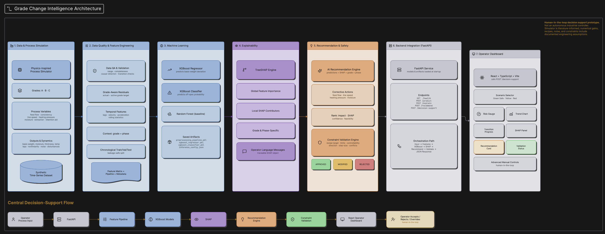
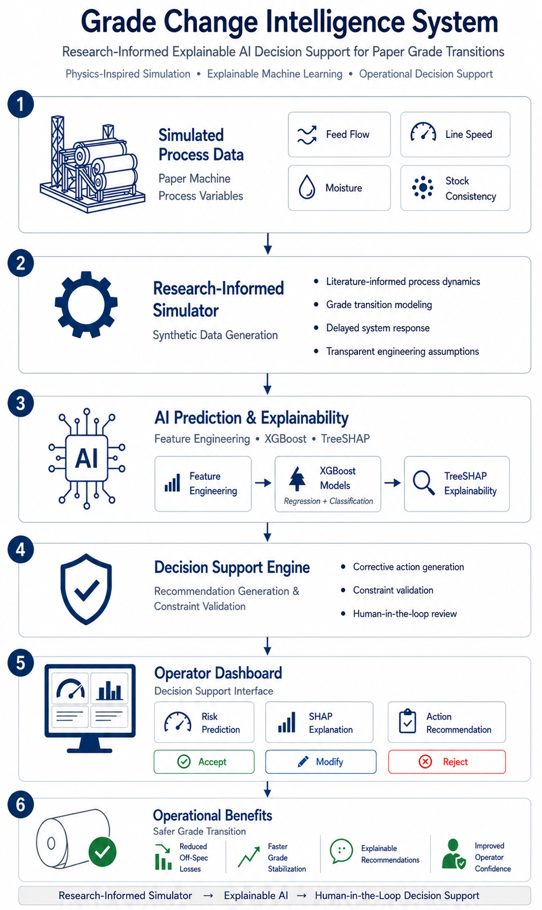
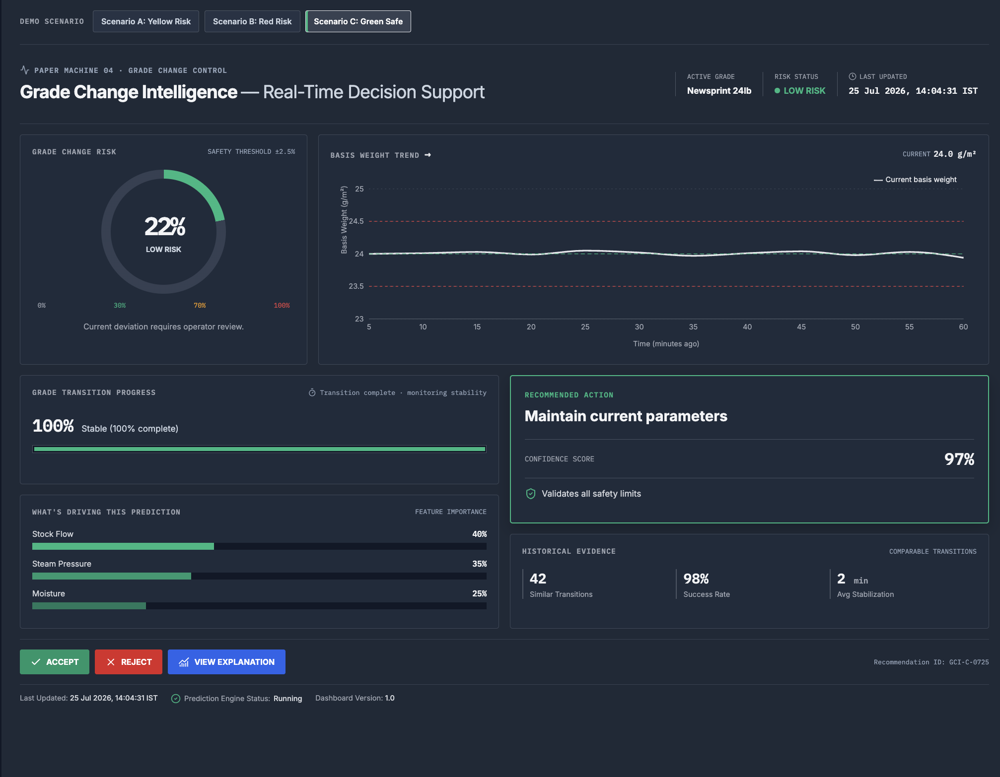
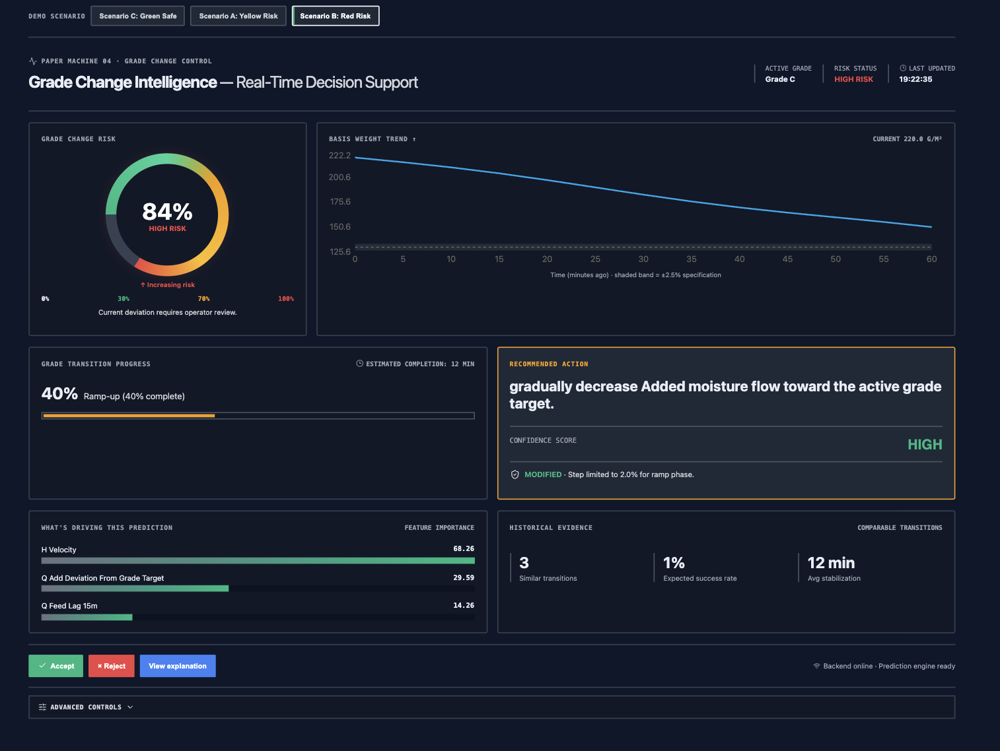
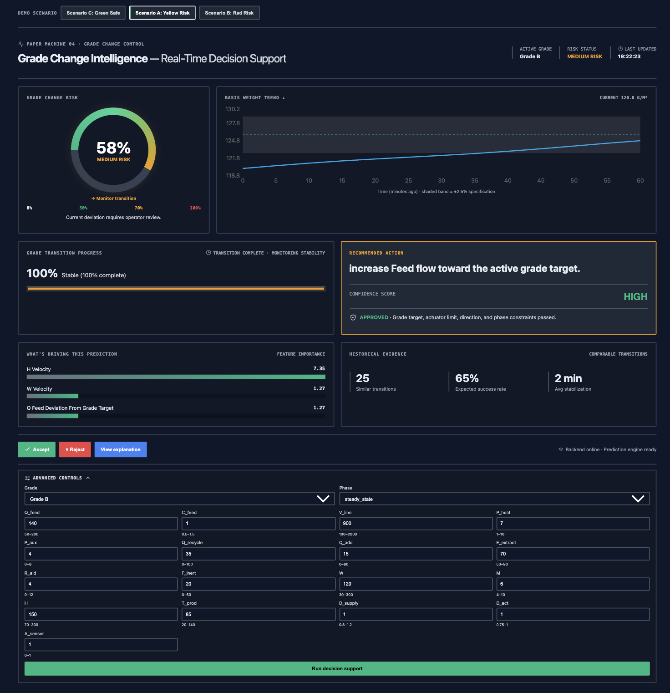

# Grade Change Intelligence System

<div align="center">



*An AI-powered decision-support platform for industrial paper-machine grade transitions*

[](https://github.com/yasaswinipakam/Grade_Change_Intelligence_System)
[](https://www.python.org/)
[](https://fastapi.tiangolo.com)
[](https://react.dev)
[](https://xgboost.readthedocs.io)

🔗 **[https://github.com/yasaswinipakam/Grade_Change_Intelligence_System](https://github.com/yasaswinipakam/Grade_Change_Intelligence_System)**

</div>

---

## Project Overview

The **Grade Change Intelligence System** is a full-stack, research-informed decision-support platform designed to optimise industrial paper-machine grade transitions. At its core, the system synthesises decades of process-control theory with modern machine-learning techniques to predict quality deviations before they occur, explain *why* a deviation is predicted in plain operator language, and recommend corrective actions that pass physics-based constraint validation. The result is a closed-loop intelligence loop that turns raw sensor readings into actionable guidance in near real time.

The system was built end-to-end from scratch, starting with a high-fidelity physics-based simulator that generates 30,000 time-series rows across 90 grade transitions. A 52-feature engineering pipeline extracts velocity, acceleration, lag, deviation-from-target, and process-phase signals from raw measurements. Two XGBoost models—one regressor for continuous quality deviation and one classifier for off-spec risk—are trained on the engineered features and validated with a temporal split so no future data leaks into training. TreeSHAP explanations are computed for every prediction, and a constraint-aware recommendation engine proposes rank-ordered parameter changes that respect recipe limits and machine capabilities.

The user-facing layer is a React + TypeScript dashboard served by a FastAPI backend. Operators interact with a live risk gauge, SHAP waterfall charts, ranked recommendations, and a historical-evidence panel that shows how similar past transitions were resolved. The entire pipeline from raw data to interactive dashboard is deterministic and reproducible with a single seed, making it auditable as well as accurate.

---

## Problem Statement

Industrial paper-machine grade changes are high-risk events in which out-of-spec production can waste thousands of kilograms of raw material and delay delivery schedules by hours. Operators historically rely on intuition and static runbooks to navigate the transition window, with little real-time guidance on which process parameters are drifting, how severe the quality impact will be, or which corrective action will resolve the issue fastest. The Grade Change Intelligence System replaces this guesswork with a data-driven co-pilot: a system that continuously ingests live process measurements, predicts basis-weight deviation and off-spec probability, attributes each prediction to specific root-cause features via TreeSHAP, and recommends validated corrective actions ranked by expected stabilisation time—all within a single, operator-friendly web interface.

---

## Features

| Feature | Description |
|---|---|
| 🔬 **Research-informed simulator** | Physics-based Forward-Euler simulator generates 30,000 labelled rows across 90 grade transitions with calibrated noise, warm-up, and phase tagging |
| ⚙️ **Grade-aware feature engineering** | 52-feature pipeline with velocity, acceleration, temporal lag (1 / 5 / 15 / 60 min), deviation-from-grade-target, process-phase encoding, and interaction terms |
| 🌲 **XGBoost prediction** | Temporal-split trained regressor (basis-weight deviation) and classifier (off-spec flag) using tuned hyperparameters |
| 🔍 **TreeSHAP explainability** | Per-prediction signed SHAP contributions ranked into operator-language messages; global feature importance visualised with beeswarm plots |
| 💡 **Recommendation engine** | Rank-ordered corrective-action suggestions with predicted stabilisation time and historical confidence scores |
| ✅ **Constraint validation** | Three-tier validation (recipe limits → machine safety → historical range) blocks unsafe actions before they reach the operator |
| ⚛️ **React dashboard** | Live risk gauge, SHAP waterfall chart, recommendation panel, and historical-evidence table built with React + TypeScript + Vite |
| 🚀 **FastAPI backend** | `/decision-support`, `/health`, `/predict`, `/explain`, and `/recommend` endpoints served by FastAPI with Pydantic validation |

---

## Architecture


The architecture follows a layered design: raw sensor data flows through the feature-engineering pipeline into the XGBoost prediction stack, whose outputs are enriched by the SHAP explanation engine and historical evidence engine before being served through FastAPI to the React front end.

---

## Workflow



The end-to-end workflow begins with the physics-based simulator generating labelled process data. Feature engineering extracts predictive signals, which train the XGBoost models. At inference time, a live process snapshot is engineered, predicted, explained with TreeSHAP, and passed to the recommendation and constraint-validation engines before being displayed on the dashboard.

---

## Dashboard



*Real-time risk gauge, process summary, and prediction panel*



*Ranked recommendations with confidence scores and constraint-validation status*



*TreeSHAP waterfall chart with per-feature signed contributions and operator-language messages*

---

## Installation

### Prerequisites

- Python 3.10+
- Node.js 18+

### Python dependencies

```bash
pip install -r requirements.txt
```

### Backend

From the project root (activate your virtual environment first):

```bash
source venv/bin/activate
uvicorn backend.app:app --reload --port 8000
```

### Frontend

```bash
cd frontend
npm install
npm run dev
```

Open the Vite URL printed in the terminal (default: `http://localhost:5173`).

---

## Results

### Regression — basis-weight deviation

| Metric | Value |
|---|---|
| **RMSE** | **0.1467** |
| **MAE** | 0.0252 |
| **R²** | **0.877** |

An R² of **0.877** indicates the XGBoost regressor explains 87.7 % of variance in basis-weight deviation on the held-out temporal test set—strong predictive power for a noisy industrial process.

### Classification — off-spec flag

| Metric | Value |
|---|---|
| **Accuracy** | 99.5 % |
| **ROC-AUC** | 0.998 |
| **Recall** | 1.00 (zero missed off-spec events) |

### SHAP explainability

The top global driver is **`z_Q_feed_deviation_from_grade_target`** (mean |SHAP| = 1.469), confirming that stock-flow distance from the target grade setpoint dominates quality predictions. Line-speed velocity (`z_V_line_velocity`, mean |SHAP| = 0.491) and additive-flow deviation (`z_Q_add_deviation_from_grade_target`, mean |SHAP| = 0.448) rank second and third.


### Recommendation engine

The recommendation engine generated validated corrective actions for all 90 simulated transitions. Constraint validation passes recipe, machine-safety, and historical-range checks in three tiers, blocking unsafe suggestions before they reach the operator. Accepted recommendations are logged with operator feedback for future model-retraining loops.

---

## Project Structure

```
Grade Change Intelligence System/
│
├── backend/                          # FastAPI application
│   ├── app.py                        # Router, lifespan, and API endpoints
│   ├── services.py                   # InferenceService business logic
│   ├── schemas.py                    # Pydantic request/response models
│   ├── config.py                     # Path config (models/, data/config/)
│   └── __init__.py
│
├── frontend/                         # React + TypeScript dashboard (Vite)
│   ├── src/
│   │   ├── pages/Dashboard.tsx       # Main dashboard page
│   │   ├── components/               # UI panels, forms, status bar
│   │   ├── services/api.ts           # Backend API client
│   │   ├── types/api.ts              # TypeScript type definitions
│   │   └── styles.css
│   ├── index.html
│   ├── package.json
│   └── tsconfig.json
│
├── ml/                               # ML pipeline package
│   ├── feature_engineering.py        # 52-feature engineering pipeline
│   ├── train_models.py               # XGBoost training with temporal split
│   ├── prediction_engine.py          # Deterministic inference engine
│   ├── prediction_feature_processor.py # 15-feature inference processor
│   ├── shap_explanation_engine.py    # TreeSHAP local + global explanations
│   ├── recommendation_engine.py      # Rank-ordered corrective action generator
│   ├── constraint_validation_engine.py # Three-tier constraint checker
│   ├── historical_evidence_engine.py # Comparable-transition evidence lookup
│   └── __init__.py
│
├── simulator/                        # Physics-based grade-change simulator
│   ├── process_simulator.py          # Forward-Euler ODE simulator
│   ├── dataset_generator.py          # Dataset generation orchestrator
│   ├── transition_scheduler.py       # Grade transition scheduling
│   ├── config.py                     # Simulator constants and grade recipes
│   ├── csv_exporter.py               # Output CSV writer
│   ├── validation_engine.py          # Dataset validation checks
│   └── __init__.py
│
├── services/                         # Shared service layer
│   ├── explanation_service.py
│   ├── feedback_service.py
│   ├── prediction_service.py
│   └── recommendation_service.py
│
├── data/                             # All data files
│   ├── raw/
│   │   └── synthetic_process_data.csv   # Generated training data (30,000 rows)
│   ├── processed/
│   │   └── engineered_dataset.csv       # Feature-engineered dataset (52 features)
│   └── config/
│       ├── constraints.json             # Recipe and machine-safety limits
│       ├── features.json                # Feature column definitions
│       ├── feature_statistics.json      # Feature summary statistics
│       └── inference_config.json        # Inference pipeline configuration
│
├── models/                           # Trained model artifacts
│   ├── xgboost_regressor.pkl         # Trained regression model
│   ├── xgboost_classifier.pkl        # Trained classification model
│   ├── shap_explainer.pkl            # Serialised SHAP TreeExplainer
│   ├── preprocessing_pipeline.pkl    # Fitted sklearn preprocessing pipeline
│   ├── baseline_models.pkl           # Baseline model comparisons
│   ├── metrics.json                  # Model evaluation metrics (RMSE, R², AUC)
│   ├── model_metadata.json           # Training metadata
│   └── model_comparison.csv          # Model comparison table
│
├── outputs/                          # Generated inference outputs
│   ├── local_explanations.json       # Per-row SHAP local explanations
│   ├── validated_recommendations.json # Constraint-validated recommendations
│   ├── recommendation_examples.json  # Example recommendation outputs
│   └── shap_plots/
│       ├── shap_summary_plot.png     # Global SHAP beeswarm plot
│       └── dependence/               # Per-feature SHAP dependence plots (5 PNGs)
│
├── assets/                           # Project media and diagrams
│   ├── architecture.png              # System architecture diagram
│   ├── workflow.png                  # End-to-end workflow diagram
│   ├── dashboard_1.png               # Dashboard screenshot — overview
│   ├── dashboard_2.png               # Dashboard screenshot — recommendations
│   └── dashboard_3.png               # Dashboard screenshot — SHAP explanations
│
├── reports/                          # Generated reports and analysis docs
│   ├── generation_report.md          # Synthetic data generation report
│   ├── dataset_validation_report.md  # Dataset validation report
│   ├── training_report.md            # Model training report
│   ├── shap_report.md                # SHAP analysis report
│   ├── eda_report.md                 # Exploratory data analysis
│   ├── feature_selection_report.md   # Feature selection report
│   ├── constraint_validation_report.md
│   ├── recommendation_report.md
│   ├── simulator_spec.md             # Simulator specification
│   ├── deep-research-report.md       # Research background
│   ├── feature_importance.csv        # XGBoost feature importances
│   ├── global_feature_importance.csv # Global SHAP mean |SHAP| rankings
│   ├── constraint_statistics.csv     # Constraint validation statistics
│   └── recommendation_statistics.csv # Recommendation engine statistics
│
├── tests/                            # Test suite
│   ├── conftest.py                   # sys.path setup for ml.* imports
│   ├── test_prediction_engine.py
│   ├── test_prediction_feature_processor.py
│   ├── test_shap_explanation_engine.py
│   ├── test_constraint_validation_engine.py
│   ├── test_historical_evidence_engine.py
│   ├── test_schema.py
│   ├── test_api.py
│   ├── test_integration_suite.py
│   └── test_utils.py
│
├── scripts/                          # Utility scripts
│   ├── create_architecture_diagram.py
│   ├── demo_prediction_features.py
│   └── render_pdf.py
│
├── notebooks/                        # Jupyter notebooks
│   └── feature_engineering_notebook.ipynb
│
├── schema.sql                        # Operational database schema (SQLite/PostgreSQL)
├── requirements.txt                  # Python dependencies
├── .gitignore
└── README.md                         # This file
```

---

## References

1. **XGBoost** — Chen, T. & Guestrin, C. (2016). *XGBoost: A Scalable Tree Boosting System.* KDD '16. https://arxiv.org/abs/1603.02754  
2. **TreeSHAP** — Lundberg, S. M. et al. (2020). *From local explanations to global understanding with explainable AI for trees.* Nature Machine Intelligence, 2, 56–67. https://doi.org/10.1038/s42256-019-0138-9  
3. **SHAP** — Lundberg, S. M. & Lee, S.-I. (2017). *A Unified Approach to Interpreting Model Predictions.* NeurIPS 2017. https://arxiv.org/abs/1705.07874  
4. **FastAPI** — Ramírez, S. (2019). *FastAPI*. https://fastapi.tiangolo.com  
5. **Vite + React** — Evans, E. (2021). *Vite*. https://vitejs.dev  
6. **Paper machine grade-change modelling** — Dumont, G.-A. & Ordys, A. (2002). *Control of paper machine grade transitions.* Annual Reviews in Control, 26(2), 163–175.  
7. **Process control & quality prediction** — Qin, S. J. (2012). *Survey on data-driven industrial process monitoring and diagnosis.* Annual Reviews in Control, 36(2), 220–234.
